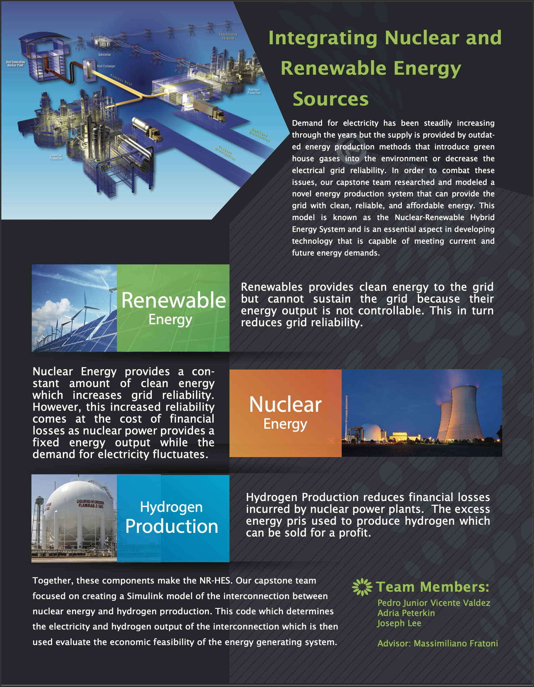

# Nuclear Renewable Hybrid Energy System Capstone Project

<b>Master of Engineering Capstone Project - Pedro Vicente, Adria Peterkin, Joseph Lee</b>

In order to address the decrease in grid stability brought on by the increasing penetration of
renewable technologies, the ability to “load follow”, to match the energy output to the demand,
is pivotal to help prevent overgeneration and oversupplying of electricity. To tackle this,
a Nuclear-Renewable Hybrid Energy System (NR-HES) was suggested. The proposed system is comprised of 
a 1 GWe molten salt reactor, renewable energy sources, and a 34 ton/day 4-step CuCl Hydrogen
Production Plant. By optimizing the operation between the components, hydrogen production costs were 
calculated to be $1.66/kg, 32% below the DOE target for 2020 of $2.30/kg. The benefit is not only
cheaper hydrogen generation but also a 40% reduction in the levelized cost of energy to $0.0199/kWh
for the HES from $0.0300/kWh for the MSR only.

# NR-HES Flyer

